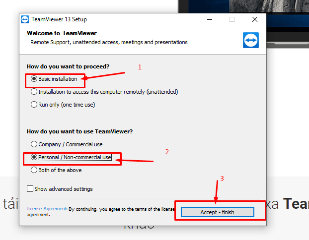

các bước cài teamviewer 13

**Bước 1: Truy cập trang web bằng link này: [teamviewer13](https://www.teamviewer.com)**   

   
**Bước 2: chọn nút tải xuống phiên bản teamviewer dành cho windows**   
  
 

 
**bước 3: mở file TeamViewer_Setup như hình dưới lên**  
 
   
bước 4: chọn checkbox như hình   
  
**lưu ý chọn đúng như trong hình.**  
Bước 5: kết quả nhận được 
    

**Cách sử dụng, teamview là phần mềm remote giữa 2 máy tính này và máy tình kia, nên phần mềm này có Your ID, password để xác định quyền truy cập.** 

**muốn người kia remote máy mình thì chỉ cần cung cấp your ID và password như hình dưới.**    

