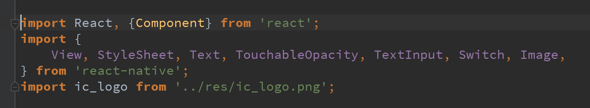
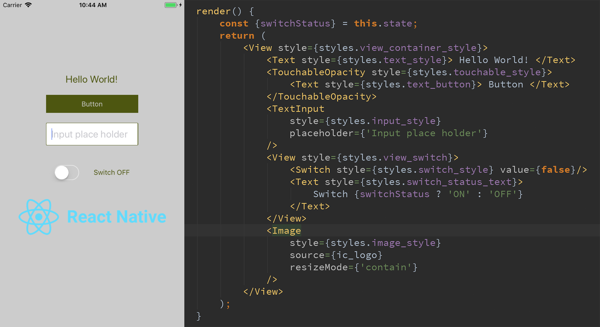
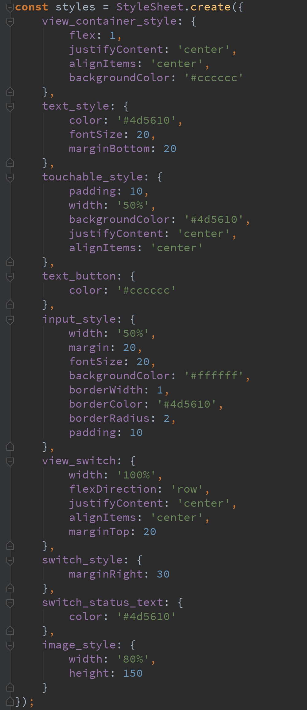
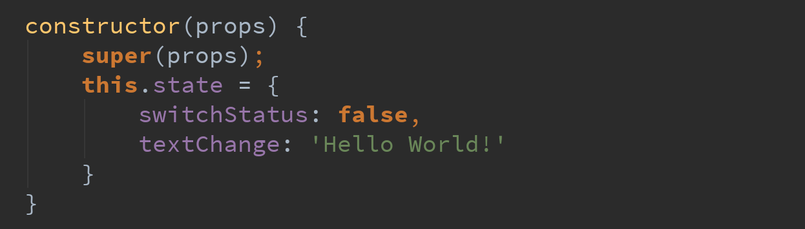
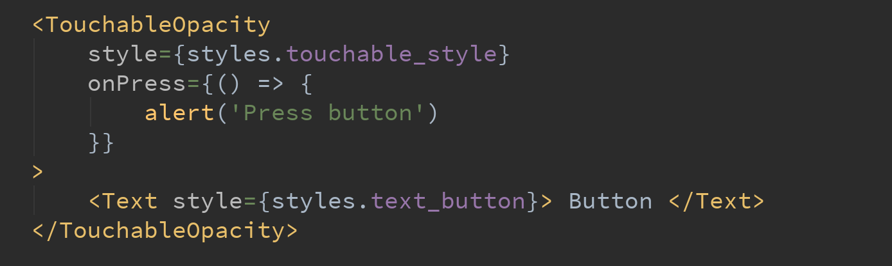
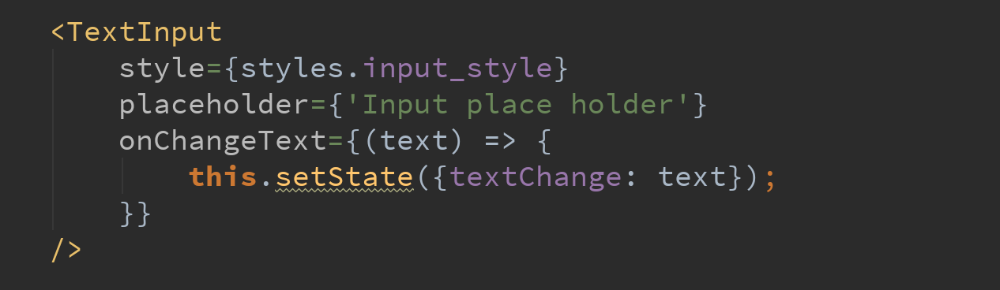
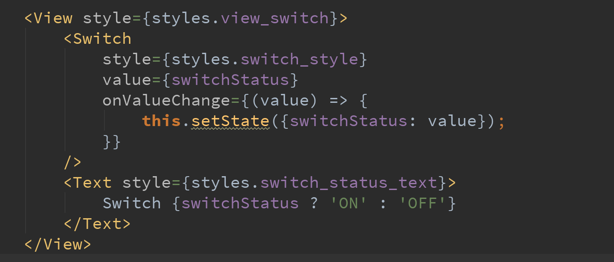

# Lab week 1

### Roadmap

- Các View cơ bản trong React-native.
    - Giới thiệt về View và Component.
    - Phân loại View.
 - Các sự kiện cơ bản của View.
    - Click event.
    - Change value event.
 - State và Props trong React native, Lifecycle của Component.
    - State.
    - Props.
    - Lifecycle.

#### 1. View





#### 2. Style



#### 3. State

 - Init default state

 

 - Get state

 ```js
    const switchStatus = this.state.switchStatus;
    const textChange = this.state.textChange;
```

 - Set state

 ```js
    this.setState({
        switchStatus:status,
        textChange:text
    });
```

#### 4. Event

 - Click Button


Handle button click



 - Text Change


Handle Input view



 - Switch change


Handle switch view



#### 5. Lifecycle

```js
    constructor()

    static getDerivedStateFromProps(props, state)

    render()

    componentDidMount()

    componentWillUnmount()
```