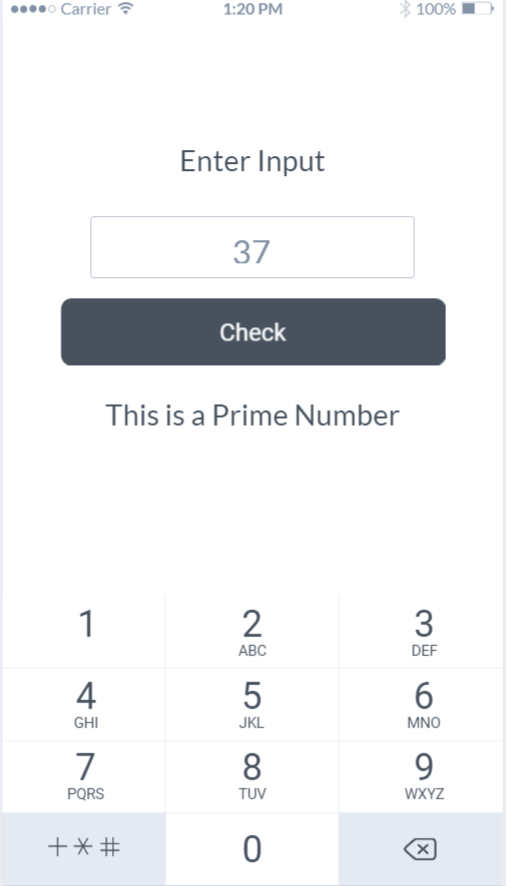

# React Native Practice Week 1

## Ứng dụng kiểm tra số nguyên tố

- [ ] Dùng React Native để tạo giao điện ứng dụng kiểm tra số nguyên tố theo mockup 
- [ ] Input được nhập vào là số thực nguyên dương
- [ ] Khi User nhấn vào ô Input, numpad sẽ được hiện ra để người dùng nhập số cần được kiểm tra vào
- [ ] Khi User click vào Button Check, nếu input là số nguyên tố, sẽ hiển thị "This is a Prime number"
- [ ] Khi User click vào Button Check, nếu input KHÔNG phải là số nguyên tố, sẽ hiển thị "This is NOT a Prime number"

### Mockup Ứng dụng check số nguyên tố

## Ứng dụng Timer

- [ ] Dùng React Native để tạo giao điện ứng dụng Timer tố theo mockup 
- [ ] User sẽ dùng Button +/- để đặt giờ. Giờ không được nhỏ hơn 00:00
- [ ] User bấm nút Reset, giờ sẽ được đặt lại là : 00:00
- [ ] User bấm nút Start, giờ sẽ được đấm ngược cho đến 00:00 và sẽ hiện ra Pop up Alert

### Mockup Timer

